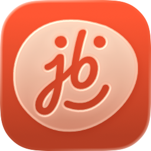
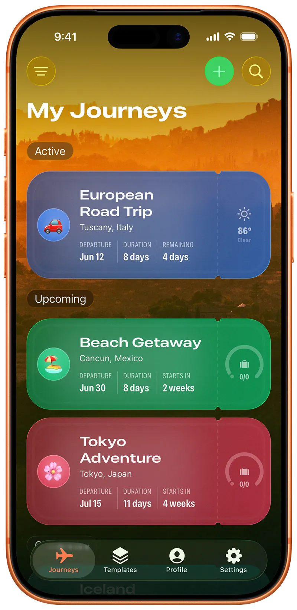
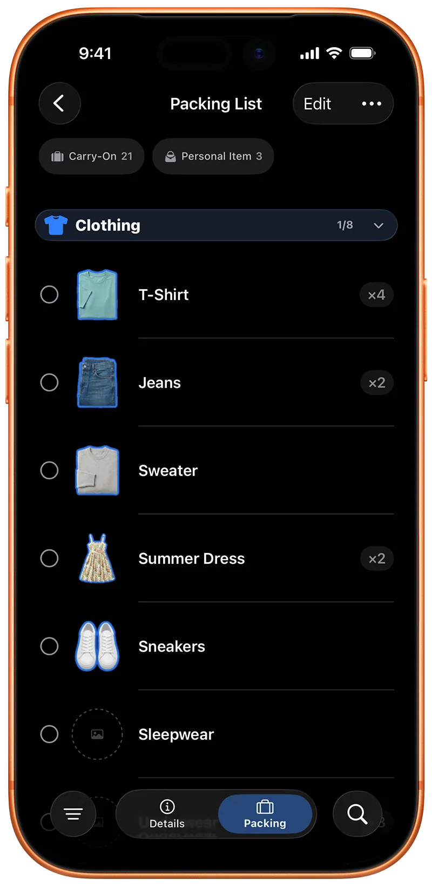
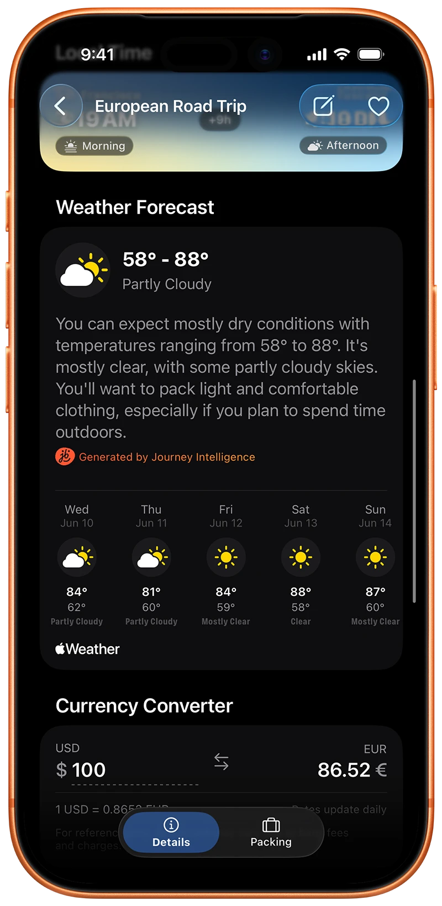
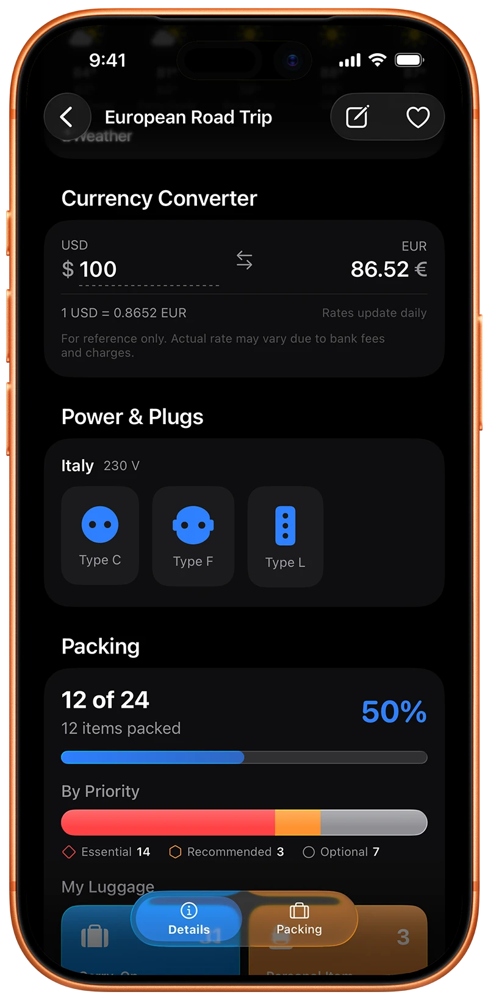

  

  # journeybot

  ### Pack smart. Enjoy the journey.

  A trip planner and packing list app for iPhone, iPad, and Mac.

  

  [Website](https://journeybot.app) &nbsp;·&nbsp; [Privacy Policy](https://journeybot.app/privacy) &nbsp;·&nbsp; [Report an issue](../../issues)

---

## What is journeybot?

Planning a trip usually means a notes app for the packing list, a weather app to figure out what to wear, a currency converter for the budget, and a folder of screenshots for flight details. journeybot puts all of it in one place. It's a native iPhone, iPad, and Mac app that builds a packing checklist tailored to your destination, dates, and planned activities, then keeps the rest of the trip's essentials one tap away.

## Features

- **Smart packing lists.** journeybot looks at your destination, travel dates, and planned activities and builds a packing checklist for that specific trip, not a generic template. Business trip, beach vacation, weekend getaway, it adapts.
- **Packing templates.** Save a list you like as a reusable template, or start from ready-made ones like Weekend Getaway, Business Trip, or Beach Vacation.
- **Item photo stickers.** Snap a photo of anything you're packing and journeybot cuts out the background to make a clean sticker for your list.
- **Weather-aware packing.** Real-time forecasts for trips coming up soon. Historical averages for trips further out, so the list still makes sense months in advance.
- **Baggage check.** Flags items like lithium batteries and power banks against carry-on rules before you get to airport security.
- **Travel essentials dashboard.** Power plug types, luggage tracking, and key dates for the trip, all in one glance.
- **Currency converter.** Convert an amount, or a quick sum like `20+10+5`, using live exchange rates without leaving the journey.
- **Home Screen widgets.** Countdown to your next trip, local destination time, and key details at a glance.
- **Apple Intelligence, on-device.** Packing suggestions, weather summaries, and Genmoji journey icons, generated privately on your device on supported hardware.
- **iCloud sync.** Every journey follows you across iPhone, iPad, and Mac. No account required.

## Screenshots

  
  
  
  

## How it compares

Packing list apps aren't new, and the established ones each do something well. Full write-ups live on the website: [PackPoint](https://journeybot.app/alternatives/packpoint) · [Packr](https://journeybot.app/alternatives/packr) · [PackGoat](https://journeybot.app/alternatives/packgoat) · [Packing Pro](https://journeybot.app/alternatives/packing-pro). The short version:

| | PackPoint | Packr | PackGoat | Packing Pro | **journeybot** |
|---|---|---|---|---|---|
| Packing list generation | Cloud-based, from live weather data | Checklist from destination, dates & weather | On-device, Apple Intelligence + WeatherKit | Rule-based assistant + 800+ item catalog | **On-device, with Apple Intelligence** |
| Account / sync | – | Requires Apple ID sign-in | Free tier; iCloud sync needs Pro ($3.99/week or $29.99 lifetime) | – | **No account, syncs free through the iCloud you already have** |
| Photo stickers for packed items | ✗ | ✗ | ✗ | Plain photos only | **✓ on-device cutout stickers** |
| Medication reminders (Apple Health) | ✗ | ✗ | ✗ | ✗ | **✓** |
| Beyond the checklist | Packing list only | Packing list, plus multi-destination & TripIt sync | Packing list, bag weight, TSA toiletry limits | Packing list, alerts, priorities | **Journey Hub: weather, power plugs, currency, local time, baggage check** |
| Platform | iOS, Android | iPhone, iPad, Mac (Apple silicon), Vision Pro | Apple platforms | iPhone, iPad, Mac, Vision¹ | **iPhone, iPad, Mac, built natively with SwiftUI** |
| Price | Free · $0.99–$2.99 one-time unlocks | Free · subscription or lifetime | Free · Pro $3.99/week or $29.99 lifetime | $2.99 upfront + IAP | **Free · subscription or one-time lifetime** |

¹ Packing Pro's most recent App Store update was version 13.5, in May 2022.

## journeybot premium

journeybot is free to use, with an optional upgrade for people who plan a lot of trips.

| | Free | Premium |
|---|---|---|
| Active journeys | 3 | Unlimited |
| Smart packing list generation | 1 | Unlimited |
| Packing templates | 3 | Unlimited |
| Item photo stickers | 5 | Unlimited |
| Currency converter | | ✓ |

Premium is available monthly, yearly, or as a one-time lifetime purchase.

## Privacy, by design

- Packing suggestions are generated entirely on-device. Nothing about your trip is sent to a server to build your list.
- No account or sign-in required. Your journeys sync across your own devices through your iCloud account.
- Full details in the [Privacy Policy](https://journeybot.app/privacy).

## Get journeybot

journeybot is available worldwide on the App Store for iPhone, iPad, and Mac.

**[Download on the App Store →](https://apps.apple.com/app/apple-store/id6756543673)**

## Feedback, bugs, and ideas

This repository doesn't hold journeybot's source. It exists to track feedback from people using the app.

- Found something broken? [Open a bug report](../../issues/new?template=bug_report.yml).
- Have an idea for a feature? [Open a feature request](../../issues/new?template=feature_request.yml).
- Press, support, or anything else: [hello@journeybot.app](mailto:hello@journeybot.app).

---

© 2026 Michal Ferák. journeybot is a trademark of Michal Ferák. All rights reserved.

